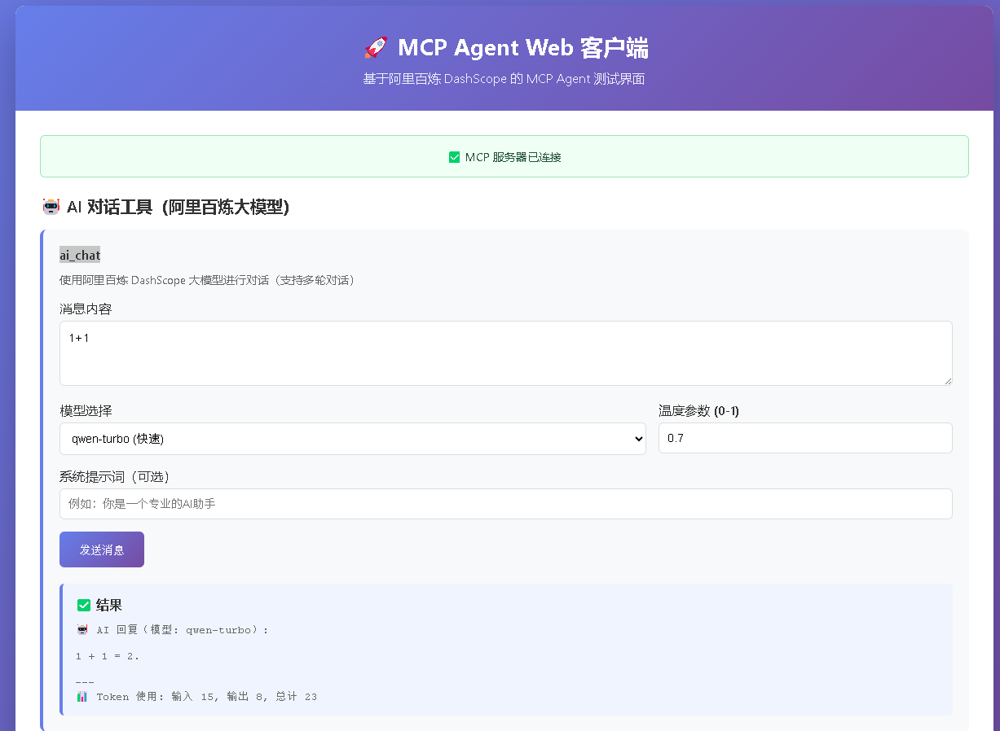

# MCP Agent with DashScope

基于阿里百炼 DashScope 平台的 Model Context Protocol (MCP) Agent 样例工程。



## 功能特性

- ✅ 完整的 MCP 协议实现
- ✅ **已集成阿里百炼 DashScope 大模型**（通过 `ai_chat` 工具调用）
- ✅ 支持工具调用（Tools）：AI 对话工具
- ✅ 支持资源访问（Resources）
- ✅ TypeScript 类型安全
- ✅ 标准化的项目结构


## 系统要求

- Node.js 18.0.0 或更高版本（需要内置 fetch API 支持）

## 快速开始

### 1. 安装依赖

```bash
npm install
```

### 2. 配置环境变量

项目已包含 `.env` 文件，API Key 已配置。如需修改，编辑 `.env` 文件：

```
DASHSCOPE_API_KEY=your-api-key-here
```

### 3. 构建项目

```bash
npm run build
```

### 4. 启动 Web 服务器（推荐）

**用户通过 Web 界面（HTML 页面）访问，无需了解底层 stdio 通信：**

```bash
npm run api
```

然后在浏览器中访问：**http://localhost:3000**


### 其他运行方式

**直接运行 MCP 服务器（用于集成到 Claude Desktop 等 MCP 客户端）：**

```bash
npm start
```

或开发模式（自动重新编译）：

```bash
npm run dev
```

**注意：** `npm start` 启动的是纯 MCP 服务器，通过 stdio 与 MCP 客户端通信。如果要在浏览器中使用，请使用 `npm run api` 启动 Web 服务器。

你将看到一个美观的 Web 界面，可以直接使用所有功能！

**说明：** 用户通过 Web 界面（HTML 页面）与系统交互，底层 MCP 服务器通过 stdio 通信是内部实现细节，用户无需关心。


## 项目结构

```
mcp-agent/
├── src/
│   ├── index.ts              # 主入口文件
│   ├── server.ts             # MCP 服务器实现
│   ├── dashscope-client.ts   # DashScope API 客户端
│   ├── api-server.ts         # Web API 服务器
│   ├── web-client.html       # Web 界面
│   ├── tools/                # 工具定义
│   │   └── ai-chat.ts        # AI 对话工具
│   └── resources/            # 资源定义
│       └── file-system.ts
├── dist/                     # 编译输出
├── package.json
├── tsconfig.json
├── test-mcp-client.js        # 测试客户端
└── README.md
```

## MCP 协议

本项目实现了 Model Context Protocol 的核心功能：

- **Tools**: 可调用的工具函数
- **Resources**: 可访问的资源
- **Prompts**: 提示词模板

## 调用流程

当用户通过 Web 界面使用 AI 对话功能时，完整的调用流程如下：

```
用户 → Web 界面 → HTTP API → MCP 协议（stdio）→ MCP 服务器 → ai_chat 工具 → DashScope API
```

### 详细说明

1. **用户操作**: 在 Web 界面输入消息，点击"发送消息"按钮
2. **Web 界面**: 调用 `callAIChat()` 函数，发送 HTTP POST 请求到 `/api/mcp/tools/call`
3. **HTTP API**: API 服务器接收请求，通过 stdio 发送 JSON-RPC 请求到 MCP 服务器
4. **MCP 协议**: 使用 JSON-RPC 2.0 协议，通过标准输入输出（stdio）通信
5. **MCP 服务器**: 解析请求，路由到 `ai_chat` 工具处理器
6. **ai_chat 工具**: 执行工具函数，调用 DashScope 客户端
7. **DashScope API**: 发送 HTTP 请求到阿里百炼 DashScope API，获取 AI 回复
8. **结果返回**: 按照相反路径返回结果，最终显示在 Web 界面上

## 使用示例

### Web 界面使用（主要方式）

启动 Web 服务器后，在浏览器中访问 `http://localhost:3000`，即可使用 AI 对话功能。

### 其他使用方式

**直接运行 MCP 服务器（用于集成到其他 MCP 客户端）：**

```bash
npm start
```

**注意：** 直接运行 `npm start` 会启动纯 MCP 服务器，通过 stdio 与 MCP 客户端通信。如果要通过 Web 界面使用，请使用 `npm run api` 启动 Web 服务器。

## 开发

### 添加新工具

在 `src/tools/` 目录下创建新的工具文件，然后在 `src/server.ts` 中注册。

### 添加新资源

在 `src/resources/` 目录下创建新的资源文件，然后在 `src/server.ts` 中注册。

## GitHub 上传

项目已准备好上传到 GitHub。已完成：
- ✅ Git 仓库初始化
- ✅ 文件已提交（已移除 README 中的真实 API Key）

### 上传步骤

1. **在 GitHub 上创建新仓库**
   - 访问 https://github.com/new
   - 填写仓库名称（如：`mcp-agent-dashscope`）
   - 选择 Public 或 Private
   - **不要**勾选 "Initialize with README"（我们已经有了）

2. **添加远程仓库并推送**
   ```bash
   # 添加远程仓库（替换 YOUR_USERNAME 和 REPO_NAME）
   git remote add origin https://github.com/YOUR_USERNAME/REPO_NAME.git
   
   # 推送代码
   git branch -M main
   git push -u origin main
   ```

**安全提示：** `.env` 文件已在 `.gitignore` 中，不会被上传。请确保不要在代码中硬编码 API Key。

## 许可证

MIT

